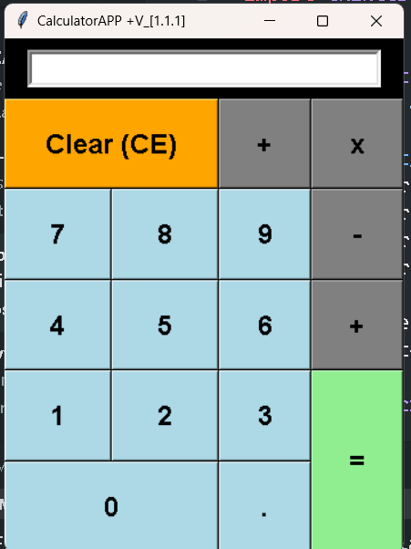

# CalculatorAPP +V_[1.1.1]

A sleek and modern calculator application built with Python's `tkinter` library. This app provides basic arithmetic functionalities with a user-friendly graphical interface.

## Features

- **Basic Arithmetic Operations**: Perform addition, subtraction, multiplication, and division.
- **Clear Functionality**: Quickly reset the calculator using the "Clear (CE)" button.
- **Responsive Design**: The layout adjusts dynamically to window resizing.
- **Customizable Appearance**: Distinct button colors and styles enhance the user experience.
- **Error Handling**: Displays an error message for invalid operations.

## Screenshots



## Installation

1. **Clone the repository**:
    ```bash
    git clone https://github.com/CodeGoura/calculator_App.git
    cd calculator-app
    ```

2. **Install required dependencies**:
    Ensure you have Python installed on your machine. This app uses the built-in `tkinter` library, which is included with Python.

## Usage

Run the `calculator.py` script to launch the calculator application:

```bash
python calculator.py
```

## Code Overview

### Main Components

- **Calculator Class**: Handles the main logic and user interface.
    - `__init__(self, root)`: Initializes the main application window.
    - `create_widgets(self)`: Sets up the entry display and buttons.
    - `create_button(self, text, row, col, color, colspan=1, rowspan=1)`: Creates and places a button in the grid.
    - `on_button_click(self, char)`: Defines the behavior for button clicks.

### Grid Layout

The grid layout ensures a structured and flexible arrangement of buttons and the display area, making the application responsive to window resizing.

### Button Configuration

Buttons are created with specific properties such as color, size, and position. Special handling is implemented for the "Clear (CE)" and "=" buttons to enhance functionality.

## Contributions

Contributions are welcome! Please fork this repository and submit pull requests with improvements or bug fixes.

## License

This project is licensed under the MIT License. See the [LICENSE](LICENSE) file for details.

---

This description should give potential users and contributors a clear understanding of the project, its features, and how to get started. Feel free to customize it further based on your preferences and specific details.
